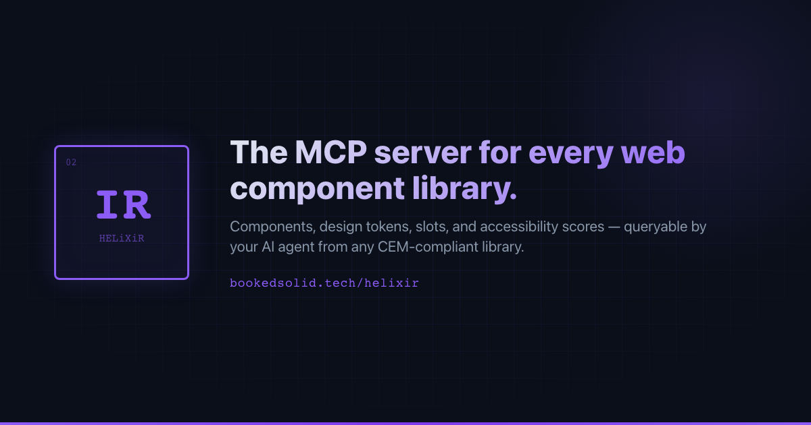

<!-- markdownlint-disable MD041 -->
<div align="center">



# HELiXiR

**Give AI agents full situational awareness of any web component library.**

Stop AI hallucinations. Ground every component suggestion in your actual Custom Elements Manifest.

[](https://www.npmjs.com/package/helixir)
[](https://www.npmjs.com/package/helixir)
[](https://opensource.org/licenses/MIT)
[](https://nodejs.org)
[](https://github.com/bookedsolidtech/helixir/actions/workflows/build.yml)
[](https://github.com/bookedsolidtech/helixir/actions/workflows/test.yml)
[](https://modelcontextprotocol.io)
[](https://www.typescriptlang.org)
[](https://www.npmjs.com/package/helixir)

[Quick Start](#quick-start) · [Why HELiXiR](#why-helixir) · [Tools Reference](#tools-reference) · [Configuration](#configuration) · [AI Tool Configs](#ai-tool-configs)

</div>

---

## Why HELiXiR

- **No more hallucinations** — AI reads your real component API from the Custom Elements Manifest, not from training data. Every attribute, event, slot, and CSS part is sourced directly from your library.
- **87+ MCP tools out of the box** — Component discovery, health scoring, design token lookup, TypeScript diagnostics, breaking-change detection, Storybook story generation, Shadow DOM styling validators, theme scaffolding, and scaffold/extend tools — all callable by any MCP-compatible AI agent.
- **Works with any web component framework** — Shoelace, Lit, Stencil, FAST, Spectrum, Vaadin, and any library that produces a `custom-elements.json` CEM file.
- **Any AI editor, zero lock-in** — Claude Code, Claude Desktop, Cursor, VS Code (Cline/Continue), Zed — one config, any tool.

---

## Quick Start

**Under 60 seconds from zero to a component-aware AI agent.**

```bash
npm install helixir
```

Then generate a starter config in your component library:

```bash
npx helixir init
# → writes mcpwc.config.json to the current directory
```

Edit `mcpwc.config.json` to point at your library:

```json
{
  "cemPath": "custom-elements.json",
  "projectRoot": "/absolute/path/to/your/component-library",
  "componentPrefix": "sl-",
  "tokensPath": "dist/tokens/tokens.json"
}
```

Add HELiXiR to your Claude Desktop config (see [AI Tool Configs](#ai-tool-configs) for other editors):

```json
{
  "mcpServers": {
    "helixir": {
      "command": "npx",
      "args": ["helixir"],
      "env": {
        "MCP_WC_PROJECT_ROOT": "/absolute/path/to/your/component-library"
      }
    }
  }
}
```

Restart Claude Desktop. Done — your AI agent now knows every property, event, slot, CSS part, and design token in your library.

---

## What You Get

### Without HELiXiR

> **You:** How do I use sl-button?
>
> **Claude:** You can use `<sl-button>` like this:
>
> ```html
> <sl-button type="primary" color="blue" rounded>Click me</sl-button>
> ```
>
> It supports `type`, `color`, `rounded`, `icon`, and `label` attributes.

**All of that is hallucinated.** `type`, `color`, `rounded`, `icon`, and `label` are not real attributes on `sl-button`. The correct attribute for the visual style is `variant`, and `rounded` doesn't exist at all.

---

### With HELiXiR

> **You:** How do I use sl-button?
>
> **Claude:** _(calls `get_component` → `sl-button`)_ Here's the accurate API for `<sl-button>`:
>
> **Attributes:**
>
> - `variant` — `'default' | 'primary' | 'success' | 'neutral' | 'warning' | 'danger' | 'text'` (default: `'default'`)
> - `size` — `'small' | 'medium' | 'large'` (default: `'medium'`)
> - `disabled` — `boolean` (default: `false`)
> - `loading` — `boolean` — Draws the button in a loading state
> - `outline` — `boolean` — Draws an outlined button
> - `pill` — `boolean` — Draws a pill-style button with rounded edges
> - `href` — `string | undefined` — Renders as `<a>` when set
>
> **Slots:** default (button label), `prefix` (before label), `suffix` (after label)
>
> **Events:** `sl-blur`, `sl-focus`, `sl-invalid`
>
> **Example:**
>
> ```html
> <sl-button variant="primary" size="medium">Save changes</sl-button>
> ```

**Every property, event, slot, CSS part, and design token — sourced directly from your Custom Elements Manifest. No hallucinations.**

---

## Framework Setup

HELiXiR works with any toolchain that produces a [`custom-elements.json`](https://github.com/webcomponents/custom-elements-manifest) (CEM). Below are quick-start setups for the most common frameworks.

### Shoelace

Shoelace ships `custom-elements.json` inside its npm package. No build step needed.

```bash
npm install @shoelace-style/shoelace
```

```json
{
  "cemPath": "node_modules/@shoelace-style/shoelace/dist/custom-elements.json",
  "componentPrefix": "sl-"
}
```

### Lit

Use the official CEM analyzer with the Lit plugin:

```bash
npm install -D @custom-elements-manifest/analyzer
```

```json
// package.json scripts
"analyze": "cem analyze --litelement --globs 'src/**/*.ts'"
```

```json
{
  "cemPath": "custom-elements.json",
  "componentPrefix": "my-"
}
```

Run `npm run analyze` after each build to keep the CEM current.

### Stencil

Enable CEM output in `stencil.config.ts`:

```ts
// stencil.config.ts
import { Config } from '@stencil/core';

export const config: Config = {
  outputTargets: [{ type: 'docs-custom' }, { type: 'dist-custom-elements' }],
};
```

Stencil emits `custom-elements.json` to your `dist/` folder:

```json
{
  "cemPath": "dist/custom-elements/custom-elements.json",
  "componentPrefix": "my-"
}
```

### FAST

FAST components ship with CEM support via the `@custom-elements-manifest/analyzer`:

```bash
npm install -D @custom-elements-manifest/analyzer
```

```json
// package.json scripts
"analyze": "cem analyze --globs 'src/**/*.ts'"
```

```json
{
  "cemPath": "custom-elements.json",
  "componentPrefix": "fluent-"
}
```

### Adobe Spectrum Web Components

Spectrum Web Components use Stencil under the hood and ship their CEM in the package:

```bash
npm install @spectrum-web-components/bundle
```

```json
{
  "cemPath": "node_modules/@spectrum-web-components/bundle/custom-elements.json",
  "componentPrefix": "sp-"
}
```

### Polymer / Generic Web Components

Any project can add CEM generation with the analyzer:

```bash
npm install -D @custom-elements-manifest/analyzer
```

```json
// package.json scripts
"analyze": "cem analyze --globs 'src/**/*.js'"
```

```json
{
  "cemPath": "custom-elements.json"
}
```

---

## Tools Reference

All tools are exposed over the [Model Context Protocol](https://modelcontextprotocol.io). Your AI agent can call any of these tools by name.

### Discovery

| Tool                          | Description                                                                          | Required Args          |
| ----------------------------- | ------------------------------------------------------------------------------------ | ---------------------- |
| `list_components`             | List all custom elements registered in the CEM                                       | —                      |
| `find_component`              | Semantic search for components by name, description, or member names (top 3 matches) | `query`                |
| `get_library_summary`         | Overview of the library: component count, average health score, grade distribution   | —                      |
| `list_events`                 | List all events across the library, optionally filtered by component                 | `tagName` _(optional)_ |
| `list_slots`                  | List all slots across the library, optionally filtered by component                  | `tagName` _(optional)_ |
| `list_css_parts`              | List all CSS `::part()` targets across the library, optionally filtered by component | `tagName` _(optional)_ |
| `list_components_by_category` | Group components by functional category (form, navigation, feedback, layout, etc.)   | —                      |

### Component

| Tool                          | Description                                                                                           | Required Args              |
| ----------------------------- | ----------------------------------------------------------------------------------------------------- | -------------------------- |
| `get_component`               | Full metadata for a component: members, events, slots, CSS parts, CSS properties                      | `tagName`                  |
| `validate_cem`                | Validate CEM documentation completeness; returns score (0–100) and issues list                        | `tagName`                  |
| `suggest_usage`               | Generate an HTML snippet showing key attributes with their defaults and variant options               | `tagName`                  |
| `generate_import`             | Generate side-effect and named import statements from CEM exports                                     | `tagName`                  |
| `get_component_narrative`     | 3–5 paragraph markdown prose description of a component optimized for LLM comprehension               | `tagName`                  |
| `get_prop_constraints`        | Structured constraint table for an attribute: union values with descriptions, or simple type info     | `tagName`, `attributeName` |
| `find_components_by_token`    | Find all components that expose a given CSS custom property token                                     | `tokenName`                |
| `find_components_using_token` | Find all components referencing a token in their `cssProperties` (works without `tokensPath`)         | `tokenName`                |
| `get_component_dependencies`  | Dependency graph for a component: direct and transitive dependencies from CEM reference data          | `tagName`                  |
| `validate_usage`              | Validate a proposed HTML snippet against the CEM spec: unknown attrs, bad slot names, enum mismatches | `tagName`, `html`          |

### Composition

| Tool                      | Description                                                                                      | Required Args |
| ------------------------- | ------------------------------------------------------------------------------------------------ | ------------- |
| `get_composition_example` | Realistic HTML snippet showing how to compose 1–4 components together using their slot structure | `tagNames`    |

### Health

| Tool                    | Description                                                                                                                            | Required Args          |
| ----------------------- | -------------------------------------------------------------------------------------------------------------------------------------- | ---------------------- |
| `score_component`       | Latest health score for a component: grade (A–F), dimension scores, and issues                                                         | `tagName`              |
| `score_all_components`  | Health scores for every component in the library                                                                                       | —                      |
| `get_health_trend`      | Health trend for a component over the last N days with trend direction                                                                 | `tagName`              |
| `get_health_diff`       | Before/after health comparison between current branch and a base branch                                                                | `tagName`              |
| `get_health_summary`    | Aggregate health stats for all components: average score, grade distribution                                                           | —                      |
| `analyze_accessibility` | Accessibility profile: ARIA roles, keyboard events, focus management, label support                                                    | `tagName` _(optional)_ |
| `audit_library`         | Generates a JSONL audit report scoring every component across 11 dimensions; returns file path (if outputPath given) and summary stats | —                      |

### Library

| Tool             | Description                                                              | Required Args |
| ---------------- | ------------------------------------------------------------------------ | ------------- |
| `load_library`   | Load an additional web component library by npm package name or CEM path | `libraryId`   |
| `list_libraries` | List all currently loaded web component libraries                        | —             |
| `unload_library` | Remove a loaded library from memory                                      | `libraryId`   |

### Safety

| Tool                     | Description                                                                        | Required Args           |
| ------------------------ | ---------------------------------------------------------------------------------- | ----------------------- |
| `diff_cem`               | Per-component CEM diff between branches; highlights breaking changes and additions | `tagName`, `baseBranch` |
| `check_breaking_changes` | Breaking-change scan across all components vs. a base branch with summary report   | `baseBranch`            |

### Framework

| Tool               | Description                                                                               | Required Args |
| ------------------ | ----------------------------------------------------------------------------------------- | ------------- |
| `detect_framework` | Identifies the web component framework in use from package.json, CEM metadata, and config | —             |

### TypeScript

| Tool                      | Description                                               | Required Args |
| ------------------------- | --------------------------------------------------------- | ------------- |
| `get_file_diagnostics`    | TypeScript diagnostics for a single file                  | `filePath`    |
| `get_project_diagnostics` | Full TypeScript diagnostic pass across the entire project | —             |

### Story

| Tool             | Description                                                                        | Required Args |
| ---------------- | ---------------------------------------------------------------------------------- | ------------- |
| `generate_story` | Generates a Storybook CSF3 story file for a component based on its CEM declaration | `tagName`     |

### Bundle

| Tool                   | Description                                                                                 | Required Args |
| ---------------------- | ------------------------------------------------------------------------------------------- | ------------- |
| `estimate_bundle_size` | Estimates minified + gzipped bundle size for a component's npm package via bundlephobia/npm | `tagName`     |

**`package` parameter derivation:**

The `estimate_bundle_size` tool accepts an optional `package` argument — the npm package name to look up (e.g. `"@shoelace-style/shoelace"`). When omitted, the tool derives the package name from your `componentPrefix` config value using a built-in prefix-to-package map:

| Prefix    | npm Package                |
| --------- | -------------------------- |
| `sl`      | `@shoelace-style/shoelace` |
| `fluent-` | `@fluentui/web-components` |
| `mwc-`    | `@material/web`            |
| `ion-`    | `@ionic/core`              |
| `vaadin-` | `@vaadin/components`       |
| `lion-`   | `@lion/ui`                 |
| `pf-`     | `@patternfly/elements`     |
| `carbon-` | `@carbon/web-components`   |

If your prefix is **not** in the list above and you omit `package`, the tool returns a `VALIDATION` error. In that case, pass the `package` argument explicitly.

### Benchmark

| Tool                  | Description                                                                                                                  | Required Args |
| --------------------- | ---------------------------------------------------------------------------------------------------------------------------- | ------------- |
| `benchmark_libraries` | Compare 2–10 web component libraries by health score, documentation quality, and API surface; returns a weighted score table | `libraries`   |

### CDN

| Tool              | Description                                                                                           | Required Args |
| ----------------- | ----------------------------------------------------------------------------------------------------- | ------------- |
| `resolve_cdn_cem` | Fetch and cache a library's CEM from jsDelivr or UNPKG by npm package name (for CDN-loaded libraries) | `package`     |

### Tokens

_(Requires `tokensPath` to be configured)_

| Tool                | Description                                                                           | Required Args |
| ------------------- | ------------------------------------------------------------------------------------- | ------------- |
| `get_design_tokens` | List all design tokens, optionally filtered by category (e.g. `"color"`, `"spacing"`) | —             |
| `find_token`        | Search for a design token by name or value (case-insensitive substring match)         | `query`       |

### TypeGenerate

| Tool             | Description                                                                              | Required Args |
| ---------------- | ---------------------------------------------------------------------------------------- | ------------- |
| `generate_types` | Generates TypeScript type definitions (.d.ts content) for all custom elements in the CEM | —             |

### Theme

| Tool                 | Description                                                                                                                                 | Required Args |
| -------------------- | ------------------------------------------------------------------------------------------------------------------------------------------- | ------------- |
| `create_theme`       | Scaffold a complete enterprise CSS theme from the component library's design tokens with light/dark mode variables and color-scheme support | —             |
| `apply_theme_tokens` | Map a theme token definition to specific components, generating per-component CSS blocks and a global `:root` block                         | `themeTokens` |

### Scaffold

| Tool                 | Description                                                                                       | Required Args |
| -------------------- | ------------------------------------------------------------------------------------------------- | ------------- |
| `scaffold_component` | Scaffold a new web component with boilerplate code based on an existing component's CEM structure | `tagName`     |

### Extend

| Tool               | Description                                                                                                      | Required Args |
| ------------------ | ---------------------------------------------------------------------------------------------------------------- | ------------- |
| `extend_component` | Generate extension boilerplate for a web component, providing a subclass with overridable methods and properties | `tagName`     |

### Styling

29 anti-hallucination validators that ground every component styling decision in real CEM data. Run `validate_component_code` as the all-in-one final check, or use individual tools for targeted validation.

| Tool                         | Description                                                                                                                                                                                                    | Required Args               |
| ---------------------------- | -------------------------------------------------------------------------------------------------------------------------------------------------------------------------------------------------------------- | --------------------------- |
| `diagnose_styling`           | Generates a Shadow DOM styling guide for a component — token prefix, theming approach, dark mode support, anti-pattern warnings, and correct CSS usage snippets                                                | `tagName`                   |
| `get_component_quick_ref`    | Complete quick reference for a component — attributes, methods, events, slots, CSS custom properties, CSS parts, Shadow DOM warnings, and anti-patterns. Use as the FIRST call when working with any component | `tagName`                   |
| `validate_component_code`    | ALL-IN-ONE validator — runs 19 anti-hallucination sub-validators (HTML, CSS, JS, a11y, events, methods, composition) in a single call. Use as the FINAL check before submitting any code                       | `html`, `tagName`           |
| `styling_preflight`          | Single-call styling validation combining API discovery, CSS reference resolution, and anti-pattern detection with inline fix suggestions. Call ONCE before finalizing component CSS                            | `cssText`, `tagName`        |
| `validate_css_file`          | Validates an entire CSS file targeting multiple components — auto-detects component tags, runs per-component and global validation with inline fixes                                                           | `cssText`                   |
| `check_shadow_dom_usage`     | Scans CSS for Shadow DOM anti-patterns: descendant selectors piercing shadow boundaries, `::slotted()` misuse, invalid `::part()` chaining, `!important` on tokens, unknown part names                         | `cssText`                   |
| `check_html_usage`           | Validates consumer HTML against a component CEM — catches invalid slot names, wrong enum values, boolean attribute misuse, and unknown attributes with typo suggestions                                        | `htmlText`, `tagName`       |
| `check_event_usage`          | Validates event listener patterns against a component CEM — catches React `onXxx` props for custom events, unknown event names, and framework-specific binding mistakes                                        | `codeText`, `tagName`       |
| `check_component_imports`    | Scans HTML/JSX/template code for all custom element tags and verifies they exist in the loaded CEM; catches non-existent components with fuzzy suggestions                                                     | `codeText`                  |
| `check_slot_children`        | Validates that children placed inside slots match expected element types from the CEM — catches wrong child elements in constrained slots (e.g. `<div>` inside `<sl-select>`)                                  | `htmlText`, `tagName`       |
| `check_attribute_conflicts`  | Detects conditional attributes used without their guard conditions — catches `target` without `href`, `min`/`max` on non-number inputs, and other attribute interaction mistakes                               | `htmlText`, `tagName`       |
| `check_a11y_usage`           | Validates consumer HTML for accessibility mistakes — catches missing accessible labels on icon buttons/dialogs/selects, and manual role overrides on components that self-assign ARIA roles                    | `htmlText`, `tagName`       |
| `check_css_vars`             | Validates CSS for custom property usage against a component CEM — catches unknown CSS custom properties with typo suggestions and `!important` on design tokens                                                | `cssText`, `tagName`        |
| `check_token_fallbacks`      | Validates CSS for proper `var()` fallback chains and detects hardcoded colors that break theme switching                                                                                                       | `cssText`, `tagName`        |
| `check_composition`          | Validates cross-component composition patterns — catches tab/panel count mismatches, unlinked cross-references, and empty containers                                                                           | `htmlText`                  |
| `check_method_calls`         | Validates JS/TS code for correct method and property usage — catches hallucinated API calls, properties called as methods, and methods assigned as properties                                                  | `codeText`, `tagName`       |
| `check_theme_compatibility`  | Validates CSS for dark mode and theme compatibility — catches hardcoded colors on background/color/border properties and potential contrast issues                                                             | `cssText`                   |
| `check_css_specificity`      | Detects CSS specificity anti-patterns — catches `!important` usage, ID selectors, deeply nested selectors (4+ levels), and inline style attributes                                                             | `code`                      |
| `check_layout_patterns`      | Detects layout anti-patterns when styling web component host elements — catches display overrides, fixed dimensions, absolute/fixed positioning, and `overflow: hidden`                                        | `cssText`                   |
| `check_css_scope`            | Detects component-scoped CSS custom properties set at the wrong scope (e.g. on `:root` instead of the component host)                                                                                          | `cssText`, `tagName`        |
| `check_css_shorthand`        | Detects risky CSS shorthand + `var()` combinations that can fail silently when any token is undefined                                                                                                          | `cssText`                   |
| `check_color_contrast`       | Detects color contrast issues: low-contrast hardcoded color pairs, mixed color sources (token + hardcoded), and low opacity on text                                                                            | `cssText`                   |
| `check_transition_animation` | Detects CSS transitions and animations on component hosts targeting properties that cannot cross Shadow DOM boundaries                                                                                         | `cssText`, `tagName`        |
| `check_shadow_dom_js`        | Detects JavaScript anti-patterns that violate Shadow DOM encapsulation — catches `.shadowRoot.querySelector()`, `attachShadow()` on existing components, and `innerHTML` overwriting slot content              | `codeText`                  |
| `check_dark_mode_patterns`   | Detects dark mode styling anti-patterns — catches theme-scoped selectors setting standard CSS properties that won't reach shadow DOM internals                                                                 | `cssText`                   |
| `resolve_css_api`            | Resolves every `::part()`, CSS custom property, and slot reference in agent-generated code against actual CEM data — reports valid/hallucinated references with closest valid alternatives                     | `cssText`, `tagName`        |
| `detect_theme_support`       | Analyzes a component library for theming capabilities — token categories, semantic naming patterns, dark mode readiness, and coverage score                                                                    | —                           |
| `recommend_checks`           | Analyzes code to determine which validation tools are most relevant — returns a prioritized list of tool names without running them all                                                                        | `codeText`                  |
| `suggest_fix`                | Generates concrete, copy-pasteable code fixes for validation issues by type (shadow-dom, token-fallback, theme-compat, method-call, event-usage, specificity, layout)                                          | `type`, `issue`, `original` |

---

## Configuration

Configuration is resolved in priority order: **environment variables > `mcpwc.config.json` > defaults**.

### `mcpwc.config.json`

Place this file at the root of your component library project (or wherever `MCP_WC_PROJECT_ROOT` points).

| Key                | Type             | Default                  | Description                                                                                                                                                                                                                                                           |
| ------------------ | ---------------- | ------------------------ | --------------------------------------------------------------------------------------------------------------------------------------------------------------------------------------------------------------------------------------------------------------------- |
| `cemPath`          | `string`         | `"custom-elements.json"` | Path to the Custom Elements Manifest, relative to `projectRoot`. Auto-discovered if omitted.                                                                                                                                                                          |
| `projectRoot`      | `string`         | `process.cwd()`          | Absolute path to the component library project root.                                                                                                                                                                                                                  |
| `componentPrefix`  | `string`         | `""`                     | Optional tag-name prefix (e.g. `"sl-"`) to scope component discovery.                                                                                                                                                                                                 |
| `healthHistoryDir` | `string`         | `".mcp-wc/health"`       | Directory where health snapshots are stored, relative to `projectRoot`.                                                                                                                                                                                               |
| `tsconfigPath`     | `string`         | `"tsconfig.json"`        | Path to the project's `tsconfig.json`, relative to `projectRoot`.                                                                                                                                                                                                     |
| `tokensPath`       | `string \| null` | `null`                   | Path to a design tokens JSON file. Set to `null` to disable token tools.                                                                                                                                                                                              |
| `cdnBase`          | `string \| null` | `null`                   | Base URL prepended to component paths when generating CDN `<script>` and `<link>` tags in `suggest_usage` output (e.g. `"https://cdn.jsdelivr.net/npm/@shoelace-style/shoelace@2/cdn"`). Does not affect `resolve_cdn_cem`. Set to `null` to disable CDN suggestions. |
| `watch`            | `boolean`        | `false`                  | When `true`, HELiXiR automatically reloads the CEM on file changes.                                                                                                                                                                                                   |
| `scoring`          | `object`         | `undefined`              | Optional scoring configuration for customizing health dimension weights. See [Configurable Health Scoring Weights](#configurable-health-scoring-weights).                                                                                                             |

**Full example:**

```json
{
  "cemPath": "dist/custom-elements.json",
  "projectRoot": "/home/user/my-design-system",
  "componentPrefix": "ds-",
  "healthHistoryDir": ".mcp-wc/health",
  "tsconfigPath": "tsconfig.build.json",
  "tokensPath": "dist/tokens/tokens.json",
  "cdnBase": "https://cdn.jsdelivr.net/npm"
}
```

### Configurable Health Scoring Weights

Enterprise teams have different priorities. A design system team may weight accessibility at 3× while a rapid-prototyping team may treat it as lower priority. The `scoring.weights` config section lets you adjust per-dimension weight multipliers:

```json
{
  "scoring": {
    "weights": {
      "documentation": 1.0,
      "accessibility": 1.5,
      "naming": 1.0,
      "apiConsistency": 1.0,
      "cssArchitecture": 1.0,
      "cemSourceFidelity": 0.5
    }
  }
}
```

Each value is a **positive multiplier** applied to that dimension's base weight (e.g. `1.5` = 50% more influence; `0.5` = half influence). Omitted keys default to `1.0` (unchanged). Setting a key to `0` or a negative number is rejected with a warning.

**Supported keys and their dimensions:**

| Config Key          | Health Dimension    | Default Weight |
| ------------------- | ------------------- | -------------- |
| `documentation`     | CEM Completeness    | 15             |
| `accessibility`     | Accessibility       | 10             |
| `typeCoverage`      | Type Coverage       | 10             |
| `apiConsistency`    | API Surface Quality | 10             |
| `cemSourceFidelity` | CEM-Source Fidelity | 10             |
| `testCoverage`      | Test Coverage       | 10             |
| `cssArchitecture`   | CSS Architecture    | 5              |
| `eventArchitecture` | Event Architecture  | 5              |
| `slotArchitecture`  | Slot Architecture   | 5              |
| `bundleSize`        | Bundle Size         | 5              |
| `storyCoverage`     | Story Coverage      | 5              |
| `naming`            | Naming Consistency  | 5              |
| `performance`       | Performance         | 5              |
| `drupalReadiness`   | Drupal Readiness    | 5              |

**Accessibility-first team example:**

```json
{
  "scoring": {
    "weights": {
      "accessibility": 3.0,
      "testCoverage": 2.0,
      "cemSourceFidelity": 0.5
    }
  }
}
```

**Rapid-prototyping team example:**

```json
{
  "scoring": {
    "weights": {
      "documentation": 0.5,
      "testCoverage": 0.5,
      "accessibility": 0.5
    }
  }
}
```

### Environment Variables

Environment variables override all config file values. Useful for CI or when pointing the same server at different libraries.

| Variable                    | Overrides          |
| --------------------------- | ------------------ |
| `MCP_WC_PROJECT_ROOT`       | `projectRoot`      |
| `MCP_WC_CEM_PATH`           | `cemPath`          |
| `MCP_WC_COMPONENT_PREFIX`   | `componentPrefix`  |
| `MCP_WC_HEALTH_HISTORY_DIR` | `healthHistoryDir` |
| `MCP_WC_TSCONFIG_PATH`      | `tsconfigPath`     |
| `MCP_WC_TOKENS_PATH`        | `tokensPath`       |
| `MCP_WC_CDN_BASE`           | `cdnBase`          |

Set `MCP_WC_TOKENS_PATH=null` (the string `"null"`) to explicitly disable token tools via env var.

See [`mcpwc.config.json.example`](./mcpwc.config.json.example) for a ready-to-copy template.

---

## AI Tool Configs

### Claude Code (CLI)

Add to `.mcp.json` in your project root (project-scoped) or `~/.claude.json` (global):

**Option 1 — Install from npm (recommended)**

```bash
npx helixir init  # generates mcpwc.config.json in your project root
```

Then add to `.mcp.json`:

```json
{
  "mcpServers": {
    "helixir": {
      "command": "npx",
      "args": ["helixir"],
      "env": {
        "MCP_WC_PROJECT_ROOT": "/absolute/path/to/your/component-library"
      }
    }
  }
}
```

**Option 2 — Install from local clone (development)**

```bash
git clone https://github.com/bookedsolidtech/helixir.git
cd helixir
pnpm install
pnpm build
```

Then add to `.mcp.json`:

```json
{
  "mcpServers": {
    "helixir": {
      "command": "node",
      "args": ["/absolute/path/to/helixir/build/index.js"],
      "env": {
        "MCP_WC_PROJECT_ROOT": "/absolute/path/to/your/component-library"
      }
    }
  }
}
```

Reload Claude Code after saving (`:mcp` to verify the server appears).

### Claude Desktop

Edit `~/Library/Application Support/Claude/claude_desktop_config.json` (macOS) or `%APPDATA%\Claude\claude_desktop_config.json` (Windows):

```json
{
  "mcpServers": {
    "helixir": {
      "command": "npx",
      "args": ["helixir"],
      "env": {
        "MCP_WC_PROJECT_ROOT": "/absolute/path/to/your/component-library"
      }
    }
  }
}
```

Restart Claude Desktop after saving.

### Cursor

Add to `.cursor/mcp.json` in your project root (or `~/.cursor/mcp.json` for global):

```json
{
  "mcpServers": {
    "helixir": {
      "command": "npx",
      "args": ["helixir"],
      "env": {
        "MCP_WC_PROJECT_ROOT": "${workspaceFolder}"
      }
    }
  }
}
```

### VS Code (Cline / Continue)

**Cline** — add to `.vscode/cline_mcp_settings.json`:

```json
{
  "mcpServers": {
    "helixir": {
      "command": "npx",
      "args": ["helixir"],
      "env": {
        "MCP_WC_PROJECT_ROOT": "${workspaceFolder}"
      }
    }
  }
}
```

**Continue** — add to `~/.continue/config.json` under `mcpServers`:

```json
{
  "mcpServers": [
    {
      "name": "helixir",
      "command": "npx helixir",
      "env": {
        "MCP_WC_PROJECT_ROOT": "/absolute/path/to/your/component-library"
      }
    }
  ]
}
```

### Zed

Add to your Zed settings (`~/.config/zed/settings.json`):

```json
{
  "context_servers": {
    "helixir": {
      "command": {
        "path": "npx",
        "args": ["helixir"],
        "env": {
          "MCP_WC_PROJECT_ROOT": "/absolute/path/to/your/component-library"
        }
      }
    }
  }
}
```

---

## Security

HELiXiR applies defense-in-depth on all inputs that touch the file system or network:

- **Path containment** — all file paths are resolved and verified to stay within `projectRoot`; `..` traversals and absolute paths outside the root are rejected.
- **Input validation** — every tool argument is validated with [Zod](https://zod.dev) schemas before reaching handler code; unknown properties are rejected via `additionalProperties: false`.
- **CDN safety** — `resolve_cdn_cem` only fetches from allowlisted CDN origins (jsDelivr, UNPKG); arbitrary URLs are not accepted.
- **No shell execution** — the server never spawns subprocesses based on user input; TypeScript diagnostics use the TS compiler API in-process.

See [`SECURITY.md`](./SECURITY.md) for the vulnerability disclosure policy.

---

## Quality Gates

Every pull request must pass all five CI checks before merge:

| Workflow     | What it checks                                      |
| ------------ | --------------------------------------------------- |
| **build**    | TypeScript type-check + `tsc` compile on Node 20/22 |
| **test**     | Full vitest suite with coverage on Node 20/22       |
| **lint**     | ESLint (TypeScript + Prettier compatibility rules)  |
| **format**   | Prettier formatting check                           |
| **security** | `pnpm audit --audit-level=high`                     |

**Pre-commit hooks** (via [husky](https://typicode.github.io/husky/) + [lint-staged](https://github.com/lint-staged/lint-staged)):

- TypeScript/JavaScript files: ESLint auto-fix → Prettier format
- JSON/CSS/Markdown/YAML files: Prettier format
- Commit messages: validated by [commitlint](https://commitlint.js.org) against conventional-commits format

**Allowed commit types:** `feat`, `fix`, `docs`, `style`, `refactor`, `perf`, `test`, `build`, `ci`, `chore`, `revert`, `audit`

See [`CONTRIBUTING.md`](./CONTRIBUTING.md) and [`LOCAL.md`](./LOCAL.md) for full setup details.

---

## Compliance

HELiXiR generates a [CycloneDX](https://cyclonedx.org/) Software Bill of Materials (SBOM) as part of every release. The `sbom.json` artifact is attached to each GitHub Release and lists all runtime and development dependencies with their versions, licenses, and package identifiers — suitable for enterprise security audits and supply-chain compliance reviews.

---

## Contributing

See [CONTRIBUTING.md](./CONTRIBUTING.md) for guidelines.

Quick steps:

1. Fork the repo and create a feature branch.
2. Run `pnpm install` to install dependencies.
3. Make your changes in `src/`.
4. Run `pnpm test` to ensure all tests pass.
5. Run `pnpm run lint && pnpm run format:check` before submitting.
6. Open a pull request with a clear description of the change.

Issues and feature requests are welcome on GitHub.

---

## License

MIT © 2025-2026 Clarity House LLC d/b/a Booked Solid Technology
